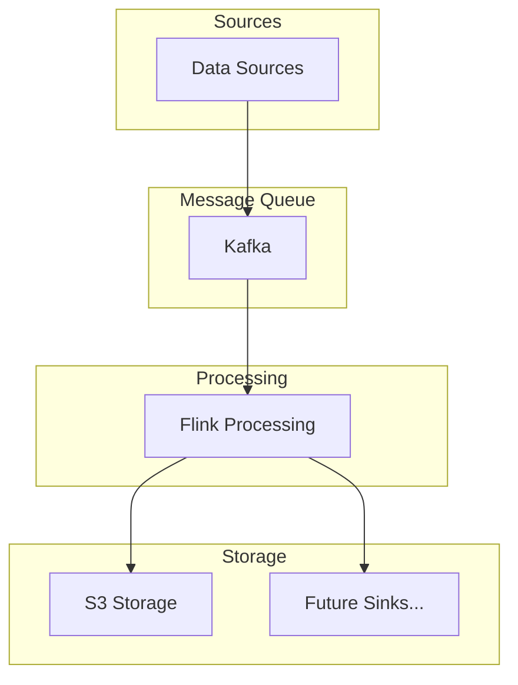

# Data Ingestion Platform

A scalable data ingestion platform built with Apache Flink for processing real-time streaming data. The platform supports ingesting data from various sources (currently Kafka) and writing to different sinks (currently S3).

## System Architecture

### High-Level Design


### Components
1. **Data Sources**
   - Clickstream events
   - CDC events (Change Data Capture)
   - Future: Support for more event types

2. **Apache Kafka**
   - Message broker for data ingestion
   - Topics organized by event types
   - Ensures durability and fault tolerance

3. **Apache Flink**
   - Stream processing engine
   - Supports exactly-once processing
   - Handles backpressure
   - Provides fault tolerance and recovery

4. **Storage Sinks**
   - Amazon S3 for data lake storage
   - Configurable partitioning and bucketing
   - Future: Support for other storage systems

## Technical Specifications

### Technology Stack
- Java 17
- Apache Flink 1.20.1
- Apache Kafka 3.6.0
- Spring Boot 3.2.3
- AWS SDK 2.31.21
- Jackson 2.15.2

### Data Formats
1. **Clickstream Events**
```json
{
    "event_id": "evt_123",
    "timestamp": 1686597600000,
    "user_id": "user_123",
    "event_type": "page_view",
    "data": {
        "page": "/home",
        "referrer": "google"
    }
}
```

2. **CDC Events**
```json
{
    "id": "change_123",
    "action": "INSERT",
    "timestamp": "2024-03-13T12:00:00Z",
    "currentEvent": {
        "field1": "value1",
        "field2": "value2"
    }
}
```

### Performance Characteristics
- Throughput: Configurable based on resources
- Latency: Sub-second processing time
- Fault Tolerance: Exactly-once processing guarantee
- Scalability: Horizontal scaling through Flink parallelism

## Project Setup

### Prerequisites
- Java 17 or higher
- Docker and Docker Compose
- Maven
- AWS CLI (for S3 sink)

### Local Development Setup

1. **Clone the Repository**
```bash
git clone <repository-url>
cd IngestionPlatform
```

2. **Start Infrastructure Services**
```bash
# Start Kafka and other services
docker-compose up -d
```

3. **Configure AWS Credentials (for S3)**
```bash
# Set up AWS credentials for LocalStack
export AWS_ACCESS_KEY_ID=test
export AWS_SECRET_ACCESS_KEY=test
export AWS_DEFAULT_REGION=us-east-1
```

4. **Build the Project**
```bash
mvn clean package
```

5. **Run the Application**
```bash
# Run in ingestion mode
java -jar target/ingestion-platform-0.0.1-SNAPSHOT.jar ingestion

# Run as web service
java -jar target/ingestion-platform-0.0.1-SNAPSHOT.jar
```

### Configuration

1. **Application Configuration**
- Located in `src/main/resources/application.yml`
- Configure Flink, Kafka, and S3 settings

2. **Job Configuration Example**
```json
{
    "jobId": "kafka-to-s3-job-001",
    "mode": "STREAMING",
    "source": {
        "type": "KAFKA",
        "bootstrapServers": "localhost:9092",
        "kafkaIngestionUnit": {
            "topic": "clickstream_data",
            "groupId": "flink-consumer-group-1"
        }
    },
    "sink": {
        "type": "S3",
        "bucketName": "clickstream",
        "s3DeliveryUnit": {
            "region": "us-east-1",
            "endpoint": "http://localhost:4566",
            "pathPrefix": "raw-data/",
            "batchInterval": "60"
        }
    }
}
```

### Testing

1. **Generate Test Data**
```bash
# Generate clickstream data
./scripts/generate_clickstream_data.sh
```

2. **Monitor Kafka Topics**
```bash
# View messages in Kafka topic
docker exec -it kafka kafka-console-consumer --bootstrap-server localhost:9092 --topic clickstream_data
```

3. **Check S3 Output**
```bash
# List files in S3 bucket (using LocalStack)
aws --endpoint-url=http://localhost:4566 s3 ls s3://clickstream/raw-data/
```

## Monitoring and Operations

### Flink Web UI
- Access the Flink dashboard at `http://localhost:8081`
- Monitor job status, parallelism, and metrics
- View detailed exception stacktraces

### Logging
- Application logs in standard output
- Configurable log levels in `log4j.properties`
- Flink job-specific logs in the Flink Web UI

### Metrics
- Flink metrics available through the Web UI
- Kafka consumer lag monitoring
- Custom metrics for business logic

## Future Enhancements
1. Support for additional data sources
2. Integration with Apache Iceberg
3. Real-time data quality checks
4. Schema evolution support
5. Enhanced monitoring and alerting
6. Support for additional sink types

## Contributing
1. Fork the repository
2. Create a feature branch
3. Commit your changes
4. Push to the branch
5. Create a Pull Request

## License
This project is licensed under the MIT License - see the LICENSE file for details.